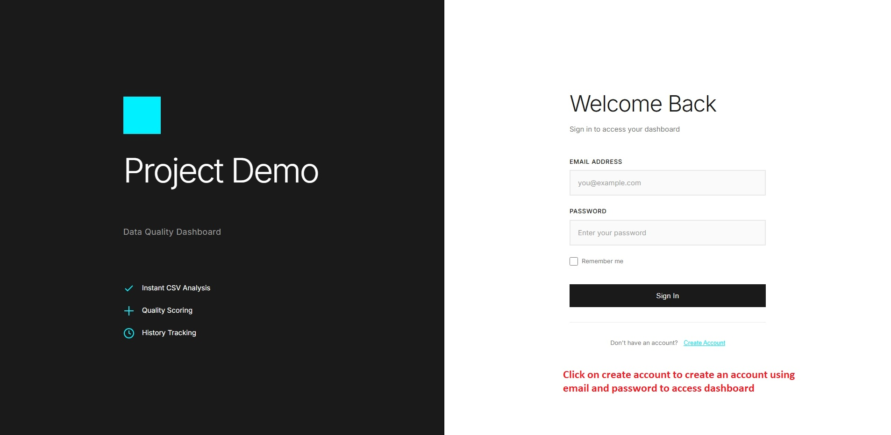
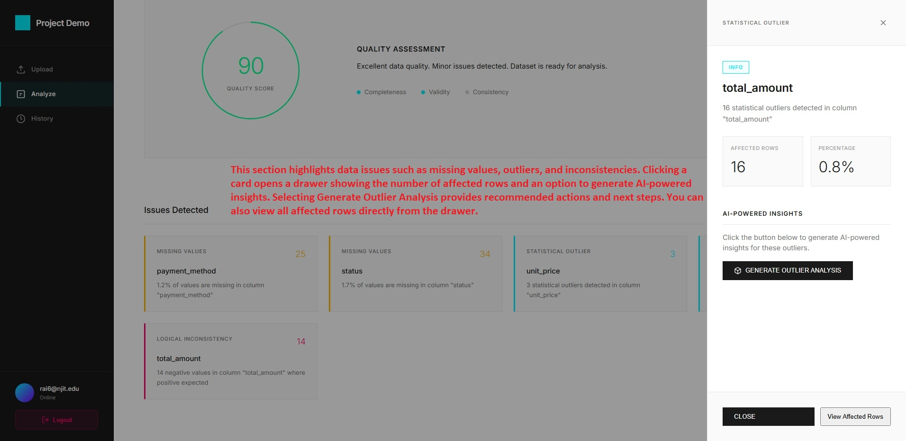
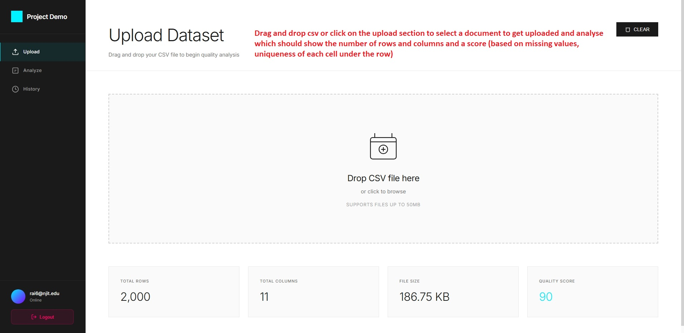
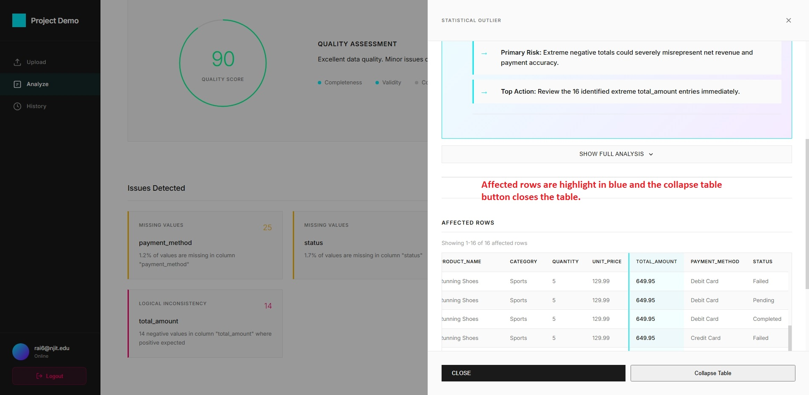
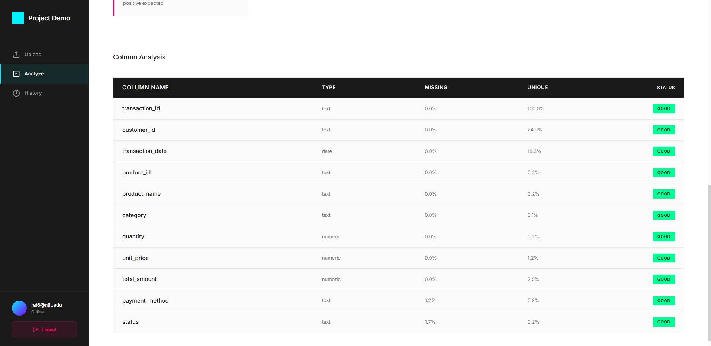
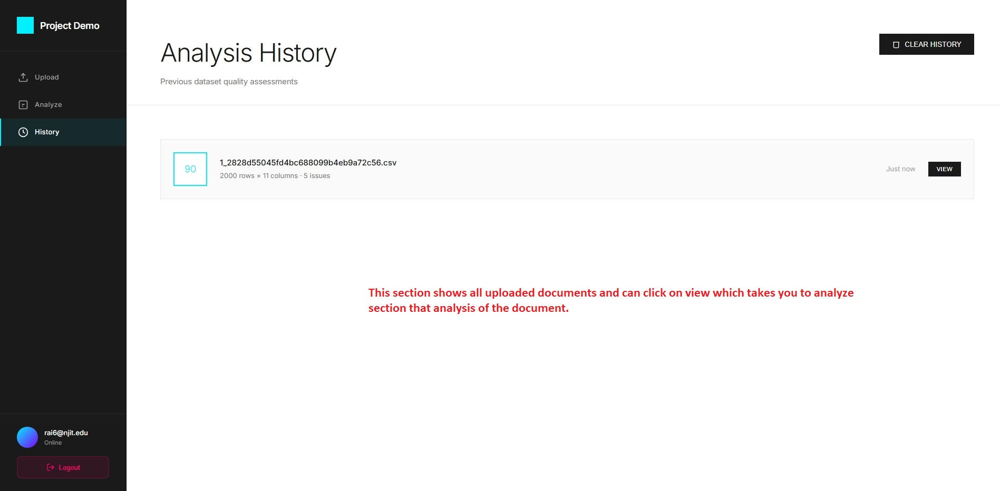

# Data Quality Dashboard

A web application for analyzing CSV datasets and identifying data quality issues. Upload a file, get instant feedback on data quality, and understand what needs to be fixed.

## What's Built

This is a fully functional data quality assessment tool deployed on Railway. Upload your CSV files and the system automatically detects:

- **Missing Values** - Empty cells and incomplete data
- **Format Issues** - Invalid emails, malformed dates, text in number fields
- **Statistical Outliers** - Numbers that are way outside the normal range
- **Logical Problems** - Things like negative ages or future dates in historical data
- **Duplicate Records** - Rows that appear more than once
- **Type Inconsistencies** - Wrong data types in columns

The app calculates an overall quality score (0-100) and gives you a detailed breakdown of each issue.

## Tech Stack

**Frontend**
- HTML, CSS, vanilla JavaScript
- Responsive design for desktop and tablet
- Drag-and-drop file upload

**Backend**
- Flask (Python web framework)
- pandas and numpy for data analysis
- MySQL database (production)
- SQLite for local development

**Deployment**
- Railway (production environment)
- Gunicorn WSGI server
- Environment-based configuration

**AI Integration**
- Google Gemini API for outlier insights
- Used Cursor IDE for development assistance

## Project Structure

```
├── app/
│   ├── __init__.py              # Flask app setup and database initialization
│   ├── models/                  # Database models
│   │   ├── user.py             # User authentication and profiles
│   │   └── analysis.py         # Analysis results storage
│   ├── routes/                  # API endpoints
│   │   ├── auth.py             # Login, signup, logout
│   │   ├── api.py              # File upload, analysis, history, export
│   │   └── main.py             # Page routes
│   └── services/                # Business logic
│       ├── file_service.py     # File upload validation and storage
│       ├── analysis_service.py # Data quality analysis algorithms
│       └── gemini_service.py   # Google Gemini API integration
├── static/
│   ├── app-backend.js          # Main application logic
│   ├── login.js                # Login page interaction
│   ├── styles.css              # Main stylesheet
│   └── login-styles.css        # Login page styles
├── templates/
│   ├── index.html              # Main dashboard
│   └── login.html              # Login/signup page
├── config.py                   # Configuration for dev/prod
├── main.py                     # Application entry point
├── requirements.txt            # Python dependencies
├── Procfile                    # Railway deployment config
└── README.md                   # This file
```

## Quick Start

### Prerequisites
- Python 3.8 or higher
- A modern web browser

### Installation

```bash
# 1. Navigate to project directory
cd delta-project-main

# 2. Create virtual environment
python -m venv venv

# 3. Activate virtual environment (Windows)
venv\Scripts\activate

# 4. Install dependencies
pip install -r requirements.txt

# 5. Run the application
python main.py
```

### Using the App

1. Open your browser and go to `http://127.0.0.1:5000`
2. Sign up with an email and password
3. Upload a CSV file (drag-and-drop or click to browse)
4. Wait for analysis to complete
5. Review your quality score and identified issues
6. Export results as JSON if needed

### Troubleshooting

**Server won't start?**
```bash
# Make sure you're in the right directory
cd delta-project-main

# Check Python version
python --version  # Should be 3.8+

# Verify virtual environment is activated
# You should see (venv) in your command prompt
```

**Can't access the app?**
- Make sure the server is running
- Try `http://localhost:5000` instead
- Check that port 5000 isn't being used by something else

**File upload issues?**
- Make sure it's a CSV file (not Excel)
- Check file size is under 50MB
- Verify first row contains headers

## User Guide

Here's how to use the app.

### Getting Started

**Creating an Account**

First visit shows a login page. Click "Create Account" to sign up:
1. Pick a username (shows in your profile)
2. Enter your email
3. Choose a password (needs at least 6 characters)
4. Click "Create Account"

You're automatically logged in after signup.



**Logging In**

If you already have an account:
1. Enter your email
2. Enter your password
3. Click "Sign In"

There's a "Remember me" checkbox if you want to stay logged in longer.

**What You'll See**

After logging in, there's a sidebar on the left with Upload, Analyze, and History. Your username shows in the bottom of the sidebar. The main area is where you upload files and see results.



### Uploading Files

Two ways to upload:

**Drag and Drop**
1. Find your CSV file on your computer
2. Drag it over the upload zone (big box in the middle)
3. Drop it there
4. It starts uploading automatically

**Click to Browse**
1. Click anywhere on the upload zone
2. File picker opens
3. Find your CSV and click Open
4. Upload starts

**File Requirements**

Needs to be:
- A CSV file (not Excel - save Excel files as CSV first)
- Under 50MB
- First row should be headers
- Regular comma-separated format

**What Happens Next**

After you drop or select a file:
1. Progress bar shows upload status
2. Analysis starts automatically
3. You'll see "Processing..." while it works
4. When done, quick stats appear: rows, columns, file size, and quality score
5. It switches to the Analyze view automatically



**Tips**
- First row should be column names, not actual data
- Get rid of blank rows at the top
- If it fails, check the file size and that it's actually CSV
- Bigger files take longer - give it a minute

### Understanding Results

When analysis finishes, the Analyze view shows your results.

**Quality Score**

Big number at the top, 0-100:
- **80-100** (green) - Looks good, only minor stuff
- **60-79** (yellow/amber) - Some issues but mostly fine
- **Below 60** (pink/red) - Needs work before using

Starts at 100 and drops points for each issue found. More serious issues cost more points.

**Quick Metrics**

Three numbers below the score:
- **Completeness** - How much of your data is actually filled in
- **Validity** - Whether stuff follows the right format (emails look like emails, dates look like dates)
- **Consistency** - Does it make sense (no negative ages, no future dates where they shouldn't be)

**Issue Cards**

Scroll down to see cards for each problem type:
- Each one shows what kind of issue it is
- How many were found
- Color tells you how serious it is

Click any card to see more details.

**Column Table**

At the bottom there's a table with info about each column:
- Column name
- What type it is (text, number, email, date)
- How many values
- How many are missing
- How many unique values
- Any issues found

Useful for getting a quick sense of each column.

### Working with Issues

**Viewing Details**

Click any issue card to see:
- Which columns have the problem
- How many rows are affected
- Some example values that have issues
- What exactly is wrong

**Seeing Affected Rows**

Most issue types have a "View Affected Rows" button. Click it to see:
- The actual rows with problems
- Problem cells are highlighted
- Row numbers so you can find them in your original file

Makes it way easier to actually fix the problems.





**Severity Levels**

Two types:
- **Error** - Big problems that mess things up (like more than 10% missing values)
- **Warning** - Problems that need attention but might be okay (like 5-10% missing)

Fix errors first, then worry about warnings if you need to.

**What to Focus On**

Each card tells you what the problem is, how many rows/columns it affects, and why it matters. Use that to figure out what to fix first.

### AI Insights

For outliers, there's an AI feature that explains what they mean.

**How to Use It**

1. Click the "Statistical Outliers" card
2. Click "Generate Outlier Analysis"
3. Wait a bit (10-30 seconds usually)
4. Read what it says

**What You Get**

The AI gives you:
- **Summary** - What the outliers mean in plain English
- **Impact** - How they might mess up your analysis or decisions
- **What to Do** - Suggestions for handling them

**When It's Useful**

Good to use when:
- You have lots of outliers and can't tell if they're mistakes or real
- You need to understand what they mean for your business
- You want ideas on what to do about them

Note: Needs internet and takes a few seconds to generate.

### Exporting Results

You can download everything as a JSON file.

**How to Do It**

1. Make sure you're looking at the Analyze view
2. Click "Export Report" in the top right
3. JSON file downloads to your computer
4. Has all the results, issues, and stats

**What's Inside**

The JSON has:
- File info (name, size, when you uploaded it)
- Quality score and metrics
- All the issues it found
- Column stats
- Affected rows for each issue type

**When to Use It**

Good for:
- Saving a copy of the analysis
- Sharing with your team
- Comparing before/after you fix things
- Importing into other tools

You can open the JSON in any text editor or import it into spreadsheets or other tools.

### Viewing History

History shows all your past analyses.

**How to See It**

1. Click "History" in the sidebar
2. List of all files you've analyzed shows up
3. Each one has:
   - Quality score (color-coded)
   - Filename
   - Rows and columns
   - When you analyzed it
   - How many issues



**Looking at Old Results**

1. Find the one you want in the list
2. Click "View"
3. Takes you to the Analyze view with those results
4. Same details as when you first ran it

**Why It's Useful**

Good for:
- Comparing before/after when you clean a file
- Seeing if data quality improved over time
- Looking back at stuff you did before
- Finding files you already analyzed

**One Thing to Know**

History is stored in the database, but when the app redeploys on Railway, history gets cleared. Each deployment starts fresh, so export anything important if you need to keep it.

### Navigation

**Sidebar**

Left sidebar has three sections:
- **Upload** - Upload new files
- **Analyze** - See current results
- **History** - Look at past analyses

Click any one to switch. The one you're on is highlighted.

**Logging Out**

Click your avatar at the bottom of the sidebar, or click the "Logout" button. Confirm you want to log out, then you're sent back to the login page.

**Your Profile**

Username shows at the bottom of the sidebar. Clicking your avatar logs you out.

**Quick Tips**

- Upload is where you start
- Analyze view appears automatically after you upload
- History is for looking back at old stuff
- You can always go back to Upload to analyze another file

## How the Analysis Works

### Data Quality Checks

**Missing Values**
- Counts empty cells in each column
- Calculates percentage of missing data
- Flags as error if >10%, warning if >5%

**Invalid Formats**
- Email validation (checks for @ symbol and domain)
- Date validation (catches future dates)
- Numeric validation (finds text in number fields)

**Statistical Outliers**
- Uses 3-sigma rule (3 standard deviations from mean)
- Identifies extreme values in numeric columns
- Can generate AI insights about outliers

**Logical Consistency**
- Flags negative values where only positive makes sense (age, price, quantity, stock)
- Checks business logic (selling price shouldn't be less than cost)
- Identifies stock levels below reorder threshold

**Duplicate Detection**
- Finds exact duplicate rows
- Helps identify and remove redundant data

### Quality Score

The score starts at 100 and loses points based on issues found:
- **80-100** - Data looks good
- **60-79** - Some issues to address
- **Below 60** - Needs work before using

## Features

### Core Functionality
- User signup and login with secure sessions
- Drag-and-drop file upload with validation
- Real-time progress indication during analysis
- Comprehensive data quality assessment
- Quality score with color-coded status
- Detailed issue breakdown by category
- Click on issues to see affected rows
- Analysis history with previous results
- Export full analysis as JSON
- AI-generated insights for outliers

### Dashboard
- Upload interface with clear instructions
- Results view showing quality score and metrics
- Issue cards showing counts and types
- Column statistics table
- History view of all previous analyses
- Responsive design works on desktop and mobile

## Configuration

### Local Development
Create a `.env` file (optional, app works without it):
```env
FLASK_ENV=development
FLASK_DEBUG=True
GEMINI_API_KEY=your-gemini-api-key
```

### Production (Railway)
The app is configured to run on Railway with:
- MySQL database on Railway
- Environment variables auto-configured
- Secure session cookies over HTTPS
- Proper error handling and logging

## API Endpoints

### Authentication
- `POST /auth/login` - User login
- `POST /auth/signup` - Create new account
- `POST /auth/logout` - User logout

### Data Analysis
- `POST /api/upload` - Upload CSV file
- `POST /api/analyze` - Analyze uploaded file
- `GET /api/history` - Get analysis history
- `GET /api/results/<id>` - Get specific analysis
- `GET /api/export/<id>` - Export analysis as JSON
- `DELETE /api/delete/<id>` - Delete analysis
- `POST /api/analyze-outliers` - Generate AI insights

## Deployment

### Live on Railway

The app is currently deployed on Railway. The production build:
- Uses MySQL database
- Runs with Gunicorn WSGI server
- Automatically deploys on git push to main
- Has HTTPS enabled
- Handles file uploads securely

### Deploying Changes

To deploy updates:
```bash
git add .
git commit -m "Description of changes"
git push origin main
```

Railway automatically redeploys when you push to main.

### Local Production Testing

To test production behavior locally:
```bash
export FLASK_ENV=production
gunicorn -w 4 -b 0.0.0.0:5000 main:app
```

## How AI Was Used in Development

### Backend Development

Used Cursor IDE's AI completion to help with:
- Recalling pandas methods (.mean(), .std(), .dropna())
- Flask patterns and decorators
- Database query syntax
- Common error handling approaches

The complex parts I did manually:
- 3-sigma outlier detection algorithm
- Quality scoring logic
- All validation rules and checks
- User authentication implementation
- CSV parsing and analysis

### Frontend Development

Cursor provided suggestions for DOM manipulation and event handling, but the actual implementation was manual:
- All UI/UX design
- File upload handler with drag-and-drop
- Results display and filtering
- Navigation between views
- Styling and responsive design

### Google Gemini Integration

Integrated Google's Gemini API for AI insights on outliers. Cursor helped with:
- API syntax and usage
- Basic request structure

But the manual work included:
- Prompt engineering for the analysis
- Structured output format
- Business context recommendations
- Error handling for API failures

### Database

Designed to work with both SQLite (development) and MySQL (production). The manual implementation included:
- Schema design
- ORM configuration
- Connection management
- Data persistence logic

### What AI Really Helped With

- Speed on boilerplate code (~20-25% faster typing)
- Quick reference for library documentation
- Standard pattern generation
- Code completion suggestions
- UI/UX design

### What I Did Manually

- All algorithms and business logic
- Database schema design
- Prompt engineering for AI features
- Authentication and security logic
- Error handling and edge cases
- Architecture decisions


The approach was practical: AI handled routine, well-documented parts while I focused on the unique logic and design decisions that matter for the product.

## Testing

### What Was Tested

Tested the app with various CSV files to ensure:
- File upload and validation works
- Analysis algorithms correctly identify issues
- Edge cases are handled (empty files, corrupted data, etc.)
- Results are accurate
- History tracking works
- Export functionality generates valid JSON
- User authentication is secure

### Known Limitations

- File size limit is 50MB (adjustable in config)
- CSV files only (no Excel or other formats)
- Drag-and-drop works in modern browsers
- AI insights require internet connection
- Database resets on Railway redeploy (files and history cleared)


## Acknowledgments

- Flask framework and Python ecosystem
- Google Gemini API for AI insights
- Railway for deployment and hosting
- Cursor IDE for development assistance
- pandas and numpy for data processing
